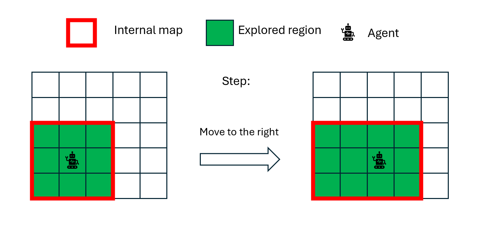

# Multi Agent System for Radioactive Waste Collection

This project simulates a multi agent system focused on the collection of radioactive waste. It is designed for research and development in robotics, environmental monitoring, and complex system simulations.

---

## Overview

The simulation models multiple agents tasked with identifying, collecting, and safely managing radioactive waste. The system serves as a tool for studying coordinated behaviors in hazardous environments.

---

## Getting Started

### Prerequisites

- **Python 3.12**
- **Git**
- **Conda** (optional but recommended for managing environments)

### Installation

1. **Clone the Repository:**

   ```bash
   git clone git@github.com:maxlegrec1/SMA_robot.git
   ```
2. **Navigate to the Project Directory:**

    ```bash
    cd SMA_robot
    ```
3. **Create and Activate a Python 3.12 Environment:**

     ```bash
    conda create -n sma_env python=3.12
    conda activate sma_env
    ```

4. **Install Required Packages**:
    ```bash
        pip install -r requirements.txt
    ```
### Running the Simulation

After completing the installation steps, run the simulation with:

    solara run main.py

## Our Definition of the Problem
In our implementation, each agents "drops" on the map and therefore doesn't know its absolute position.

Instead, it has an internal map that it updates at each steps.




### Simulation Ending Criteria
The simulation ends when the collected waste threshold has reached 90%, or the number of steps has reached `max_steps`.


## Agent Class Overview

The project implements a multi-agent system with different types of agents working together to handle radioactive waste. The agent hierarchy is structured as follows:

```
BaseAgent (Abstract Base Class)
├── RadioactivityAgent
├── RobotAgent
│   └── RefinedAgent
└── WasteAgent
```

### BaseAgent
The foundation of all agents in the system. It provides core functionality:
- Maintains a knowledge base (`knowledge` dictionary)
- Implements the basic agent lifecycle through `step_agent()` and `update_knowledge()`
- Defines the abstract `deliberate()` method for decision-making

### RadioactivityAgent
Represents radioactive areas in the environment:
- Tracks radioactivity levels
- Used by other agents to assess environmental hazards

### RobotAgent
The main worker agent that handles waste collection and transportation:
- Has a color-based classification system (green, yellow, red)
- Maintains an internal map of the environment
- Implements waste pickup and drop-off mechanics
- Has a maximum allowed radioactivity threshold based on its color
- Uses a state machine for decision making (FINDING_WASTE, TRANSPORTING)

### RefinedAgent
An enhanced version of RobotAgent with improved decision-making:
- Inherits all RobotAgent capabilities
- Implements more sophisticated pathfinding
- Uses advanced exploration strategies
- Optimizes waste collection based on color priorities

### WasteAgent
Represents radioactive waste items in the environment:
- Has a color classification (green, yellow, red)
- Tracks pickup and arrival status
- Can be transported by RobotAgents

### Key Features
1. **Color-based Hierarchy**: Agents and waste are classified by colors (green, yellow, red), representing different radioactivity levels
2. **Internal Mapping**: RobotAgents maintain an internal map of the environment, including:
   - Radioactivity levels
   - Agent positions
   - Waste locations
   - Information age
3. **State-based Behavior**: Agents use states to determine their actions:
   - FINDING_WASTE: Exploring and searching for waste
   - TRANSPORTING: Moving waste to appropriate locations
4. **Safety Mechanisms**: Agents respect radioactivity thresholds based on their color classification
5. **Knowledge Management**: Agents continuously update their knowledge based on observations

### Agent Interactions
1. RobotAgents can pick up and transport WasteAgents
2. Agents use RadioactivityAgent information to avoid dangerous areas
3. RefinedAgents implement more sophisticated strategies for waste collection
4. All agents share the same base knowledge management system


## Saving runs
Runs are saved automatically in `./results/` when using the visualization. For each run, the position of each robot at each time step is kept, as well as the progression of the collected waste. The informations can be seen in the different csv files defined for each agent type.

The purpose of this saving mechanism was to gather as much data as possible, and analyze it on a downstream task if needed.

## Agents performance analysis


## License

This project is open-source. Please refer to the LICENSE file in the repository for more details.

---

## Contact

For any questions or additional information, please contact the project maintainer.
